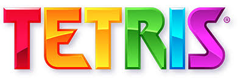

<p align="center">
  
</p>

<h1 align="center">Tetris</h1>

<p align="center">Good Old Tetris Game.</p>

<p align="center">
  
  
  <a href="https://github.com/th92rodr/tetris/commits/master">
    
  </a>
  
  <a href="https://github.com/th92rodr/tetris/stargazers">
    
  </a>
</p>

<p align="center">
  
</p>

## About

Good old Tetris game.

## Tech Stack

The following tools were used for building this project:

- [React.js](https://pt-br.reactjs.org/)
- [Styled Components](https://www.styled-components.com/)

---

## How it works

### Pre-requisites

Before you begin, you will need to have the following tools installed on your machine:

- `Node.js`<br />
  recommend version 12.18

  `Node` can be installed from `https://nodejs.org/en/`.

- `NPM`:<br />
  recommend version 6.14

  Installing `Node` will also install `NPM` automatically.

### Running the APP

- Install the project dependencies:

```sh
npm install
```

- Start the APP:

```sh
npm start
```

---

## License

This project is under the license [MIT](./LICENSE).
